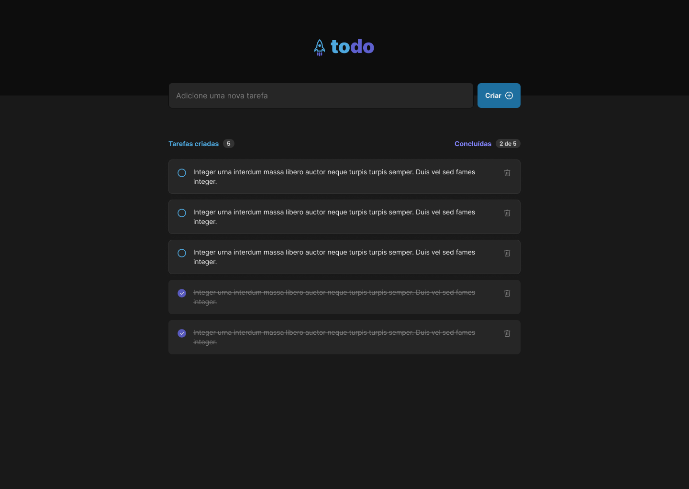

## To-Do List

Na criação deste projeto utilizei os conceitos básicos do React desenvolvendo do zero uma simples lista de tarefas com as opções de criar, apagar e marcar como concluído ou não um item da lista.

### 🛠️ Nesse projeto foi utilizado

- Vite
- CSS Modules
- Typescript
- Local Storage

 

  

  

 

  

